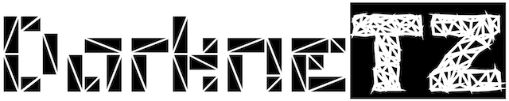

This is an application that runs several layers of a Deep Neural Network (DNN) model in TrustZone.

This application is based on [Darknet DNN framework](https://pjreddie.com/darknet/) and needs to be run with [OP-TEE](https://www.op-tee.org/), an open source framework for Arm TrustZone.

---------------------------
Please consider citing this corresponding paper at [MobiSys 2020](https://www.sigmobile.org/mobisys/2020/) if this project is helpful to you:

**[DarkneTZ: Towards Model Privacy at the Edge using Trusted Execution Environments](https://arxiv.org/abs/2004.05703)** Fan Mo, Ali Shahin Shamsabadi, Kleomenis Katevas, Soteris Demetriou, Ilias Leontiadis, Andrea Cavallaro, Hamed Haddadi


# Prerequisites
You can run this application with real TrustZone or a simulated one by using QEMU.

**Required System**: Ubuntu-based distributions

**For simulation**, no additional hardware is needed.

**For real TrustZone, an additional board is required**. Raspberry Pi 3, HiKey Board, ARM Juno board, etc. Check this [List](https://optee.readthedocs.io/en/latest/building/devices/index.html#device-specific) for more info.

# Setup
## (1) Set up OP-TEE
1) Follow **step1** ~ **step5** in "**Get and build the solution**" to build the OP-TEE solution.
https://optee.readthedocs.io/en/latest/building/gits/build.html#get-and-build-the-solution

2) **For real boards**: If you are using boards, keep follow **step6** ~ **step7** in the above link to flash the devices. This step is device-specific.

   **For simulation**: If you have chosen QEMU-v7/v8, run the below command to start QEMU console.
```
make run
(qemu)c
```

3) Follow **step8** ~ **step9** to test whether OP-TEE works or not. Run:
```
tee-supplicant -d
xtest
```

Note: you may face OP-TEE related problem/errors during setup, please also free feel to raise issues in [their pages](https://github.com/OP-TEE/optee_os).

## (2) Build DarkneTZ
1) clone codes and datasets
```
git clone https://github.com/mofanv/darknetz.git
git clone https://github.com/mofanv/tz_datasets.git
```
Let `$PATH_OPTEE$` be the path of OPTEE, `$PATH_darknetz$` be the path of darknetz, and `$PATH_tz_datasets$` be the path of tz_datasets.

2) copy DarkneTZ to example dir
```
mkdir $PATH_OPTEE$/optee_examples/darknetz
cp -a $PATH_darknetz$/. $PATH_OPTEE$/optee_examples/darknetz/
```

3) copy datasets to root dir
```
cp -a $PATH_tz_datasets$/. $PATH_OPTEE$/out-br/target/root/
```

4) rebuild the OP-TEE

**For simulation**, to run `make run` again.

**For real boards**, to run `make flash` to flash the OP-TEE with `darknetz` to your device.

5) after you boot your devices or QEMU, test by the command 
```
darknetp
```
Note: It is NOT `darknetz` here for the command.

You should get the output:
 ```
# usage: ./darknetp <function>
 ```
Awesome! You are ready to run DNN layers in TrustZone.

# Train Models

1) To train a model from scratch 
```
darknetp classifier train -pp_start 4 -pp_end 10 cfg/mnist.dataset cfg/mnist_lenet.cfg
```
You can choose the partition point of layers in the TEE by adjusting the argument `-pp_start` and `-pp_end`. Any sequence layers (first, middle, or last layers) can be put inside the TEE.

Note: you may suffer from insufficient secure memory problems when you run this command. The preconfigured secure memory of darknetz is `TA_STACK_SIZE = 1*1024*1024` and `TA_DATA_SIZE = 10*1024*1024` in `ta/user_ta_header_defines.h` file. However, the maximum secure memory size can differ from different devices (typical size is 16 MiB) and maybe not enough. When this happens, you may want to either, configure the needed secure memory to be smaller, or increase the secure memory of the device (for QEMU go to the [link here](https://github.com/OP-TEE/optee_os/issues/2079)).

When everything is ready, you will see output from the Normal World like this:
```
# Prepare session with the TA
# Begin darknet
# mnist_lenet
# 1
layer     filters    size              input                output
    0 conv      6  5 x 5 / 1    28 x  28 x   3   ->    28 x  28 x   6  0.001 BFLOPs
    1 max          2 x 2 / 2    28 x  28 x   6   ->    14 x  14 x   6
    2 conv      6  5 x 5 / 1    14 x  14 x   6   ->    14 x  14 x   6  0.000 BFLOPs
    3 max          2 x 2 / 2    14 x  14 x   6   ->     7 x   7 x   6
    4 connected_TA                          294  ->   120
    5 dropout_TA    p = 0.80                120  ->   120
    6 connected_TA                          120  ->    84
    7 dropout_TA    p = 0.80                 84  ->    84
    8 connected_TA                           84  ->    10
    9 softmax_TA                                       10
   10 cost_TA                                          10
# Learning Rate: 0.01, Momentum: 0.9, Decay: 5e-05
# 1000
# 28 28
# Loaded: 0.197170 seconds
# 1, 0.050: 0.000000, 0.000000 avg, 0.009999 rate, 3.669898 seconds, 50 images
# Loaded: 0.000447 seconds
# 2, 0.100: 0.000000, 0.000000 avg, 0.009998 rate, 3.651714 seconds, 100 images
...
```

Layers with `_TA` are running in the TrustZone. When the last layer is inside the TEE, you will not see the loss from Normal World. The training loss is calculated based on outputs of the model which belong to the last layer in the TrustZone, so it can only be seen from the Secure World. That is, the output from the Secure World is like this:
```
# I/TA:  loss = 1.62141, avg loss = 1.62540 from the TA
# I/TA:  loss = 1.58659, avg loss = 1.61783 from the TA
# I/TA:  loss = 1.57328, avg loss = 1.59886 from the TA
# I/TA:  loss = 1.52641, avg loss = 1.57889 from the TA
...
```

2) To use pre-trained models

You can also load a pre-trained model into both Normal World and Secure World and then fine-tune the model, by commands:
```
darknetp classifier train -pp_start 4 -pp_end 9 cfg/mnist.dataset cfg/mnist_lenet.cfg models/mnist/mnist_lenet.weights
```

~~(Note: the Secure World only accepts a model that has been trained using the same `-pp` value, since layers are encrypted when they are transferred back to save and layers will be decrypted when deploying into the TrustZone)~~
(Note: The encryption and decryption when layers go in and out the TEE have been disabled considering it is only for simulation here)


# Inference

By simply typing the following command, you can do inference using a pre-trained model.
```
darknetp classifier predict -pp_start 4 -pp_end 10 cfg/mnist.dataset cfg/mnist_lenet.cfg models/mnist/mnist_lenet.weights  data/mnist/images/t_00007_c3.png
```
When the layer is inside the TEE, we want to hide the output in some ways as well (for defending against potential attacks (e.g. membership inference)). Showing the confidence score of inference also leaks privacy, so if the softmax layer is in the TEE, it only transfers back the `top1` prediction. You will get results like this:

```
100.00%: 3
 0.00%: 1
 0.00%: 2
 0.00%: 0
 0.00%: 4
```
This can be changed to other normalization ways (Top 5 or ranks only) and can be easily implemented as well. We leave it here.

More functions to be added ;)

# License
```
MIT License

Copyright (c) 2019 Fan Mo, f.mo18@imperial.ac.uk

Permission is hereby granted, free of charge, to any person obtaining a copy
of this software and associated documentation files (the "Software"), to deal
in the Software without restriction, including without limitation the rights
to use, copy, modify, merge, publish, distribute, sublicense, and/or sell
copies of the Software, and to permit persons to whom the Software is
furnished to do so, subject to the following conditions:

The above copyright notice and this permission notice shall be included in all
copies or substantial portions of the Software.

THE SOFTWARE IS PROVIDED "AS IS", WITHOUT WARRANTY OF ANY KIND, EXPRESS OR
IMPLIED, INCLUDING BUT NOT LIMITED TO THE WARRANTIES OF MERCHANTABILITY,
FITNESS FOR A PARTICULAR PURPOSE AND NONINFRINGEMENT. IN NO EVENT SHALL THE
AUTHORS OR COPYRIGHT HOLDERS BE LIABLE FOR ANY CLAIM, DAMAGES OR OTHER
LIABILITY, WHETHER IN AN ACTION OF CONTRACT, TORT OR OTHERWISE, ARISING FROM,
OUT OF OR IN CONNECTION WITH THE SOFTWARE OR THE USE OR OTHER DEALINGS IN THE
SOFTWARE.
```
